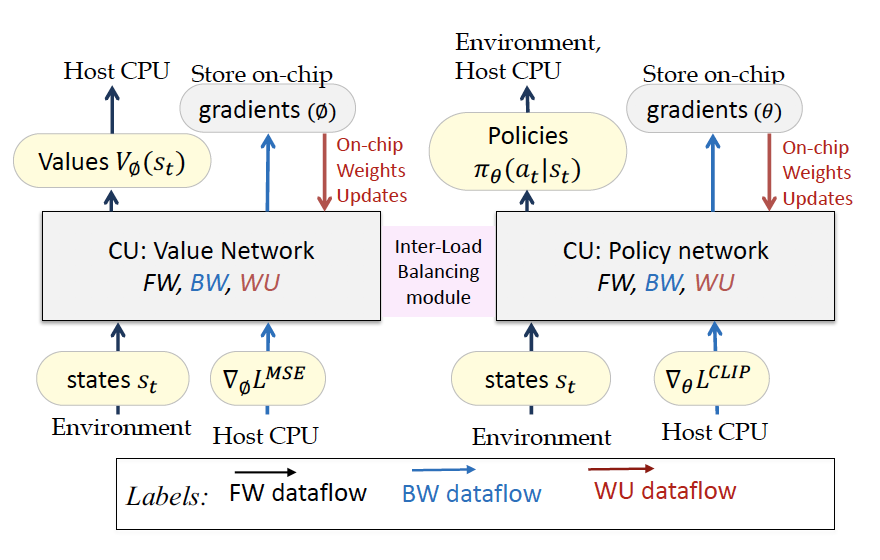

# PPO_2CU
> This is the implementation of FPGA-based Proximal Policy Optimization acceleration.

One to two paragraph statement about your product and what it does.

## Platform Requirement

Xilinx Vivado Design Suite: https://www.xilinx.com/products/design-tools/vivado.html

## Usage

